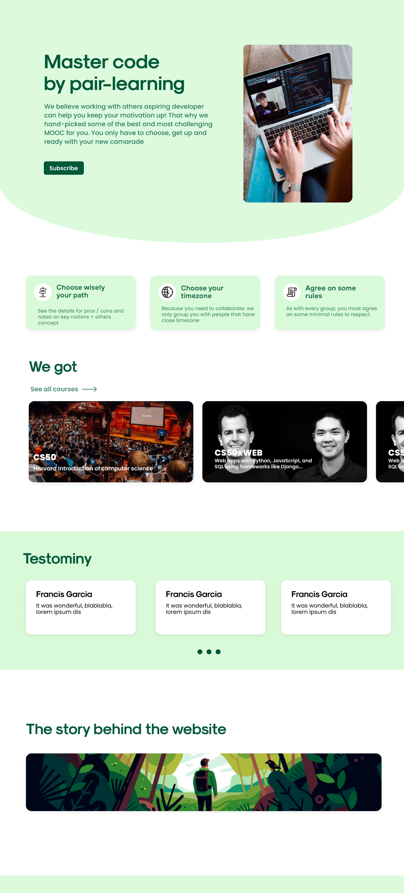
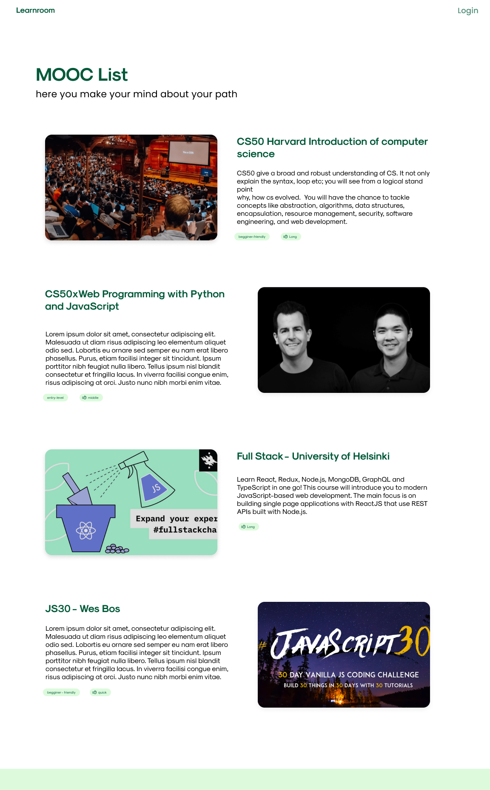
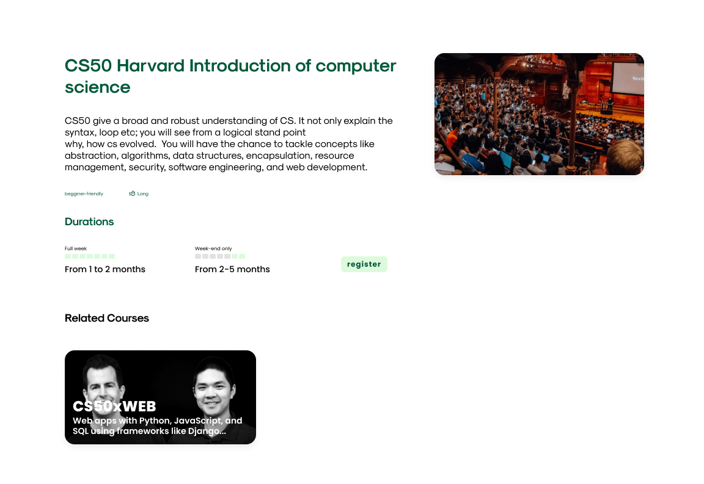
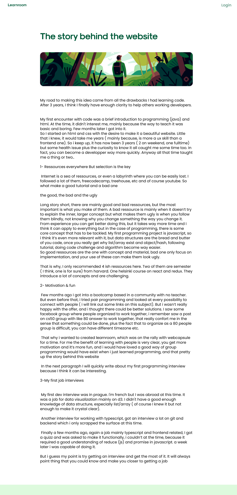

# learnroom

### learnroom is a platform to facilitate remote peer learning(for development / cs). You can find people from your own timezone, choose rythm (fullweek or weekend) and rules.

### As we begin, we choose to only focus on 4 mooc, CS50, CS50xWeb , Fullstack Open and JS30.

### A group is bounded within 3 to 8 people, in the beggining we will start by waves of begging date as few people will be registered. And that all we hope. If by chance more people suscribe we will see what is best 

here are some of our unfinished wireframes 

