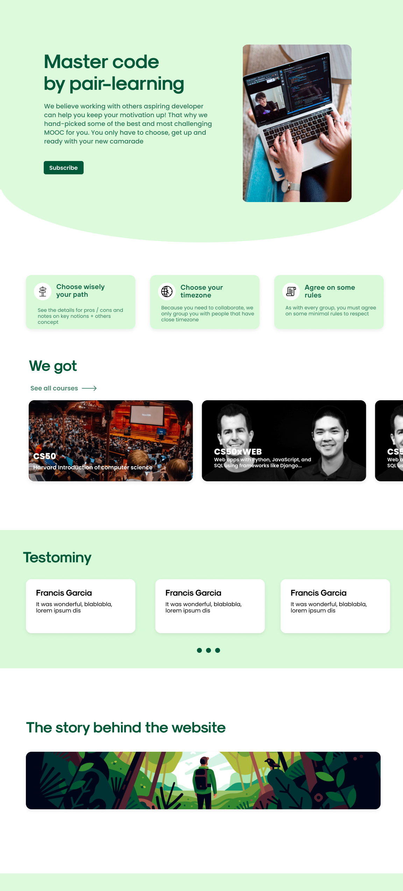
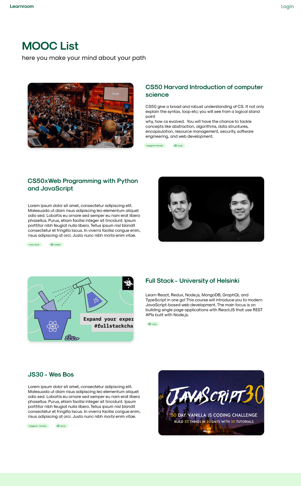
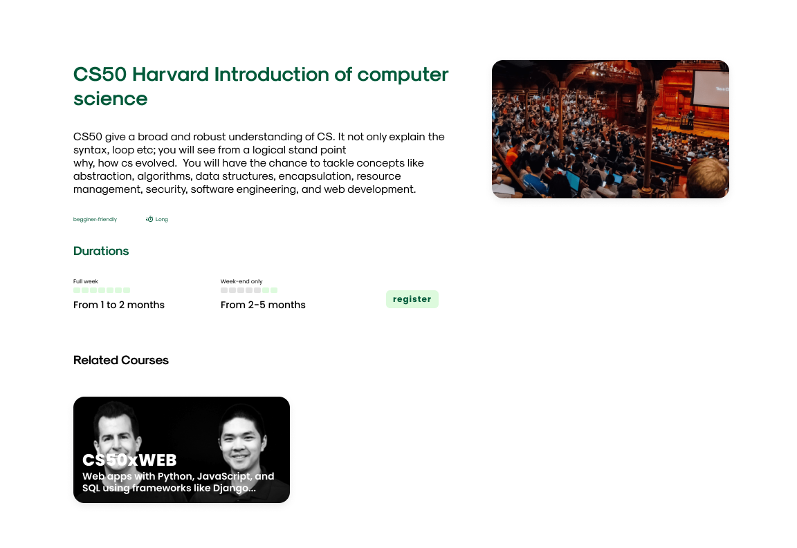
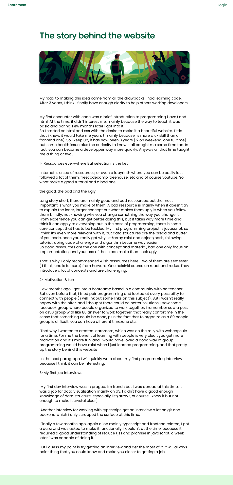

# learnroom

### learnroom is a platform to facilitate remote peer learning(for development / cs). You can find people from your own timezone, choose rythm (fullweek or weekend) and rules.

### As we begin, we choose to only focus on 4 mooc, CS50, CS50xWeb , Fullstack Open and JS30.

here are some of our unfinished wireframes 

